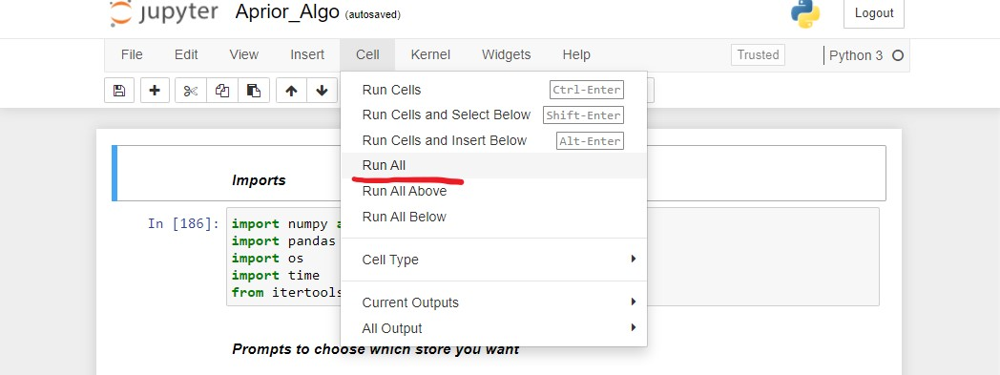
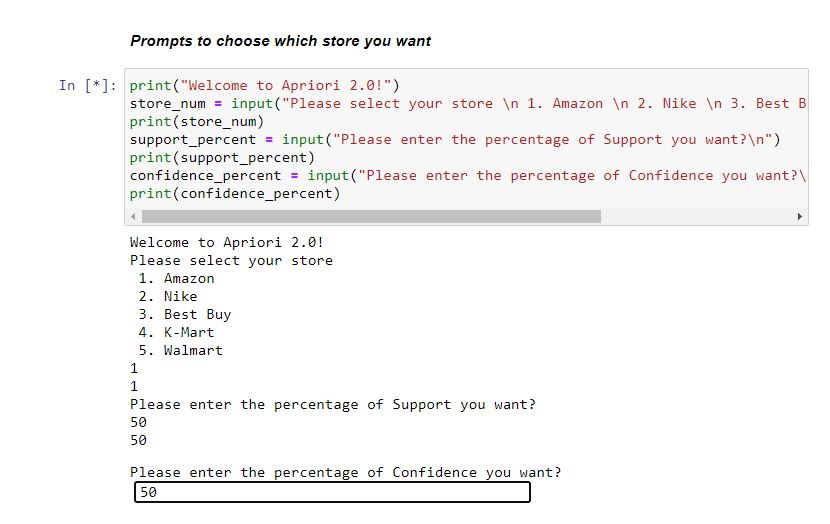
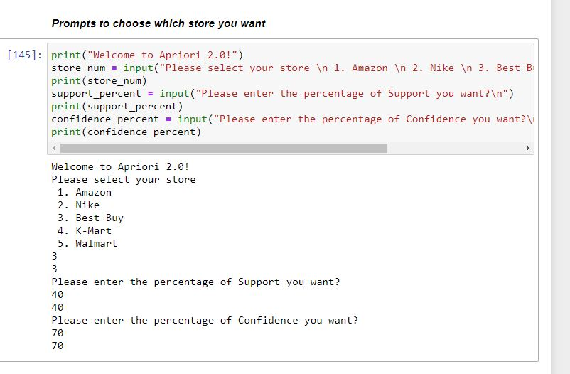
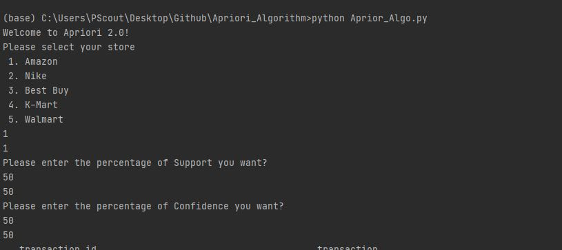
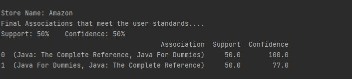
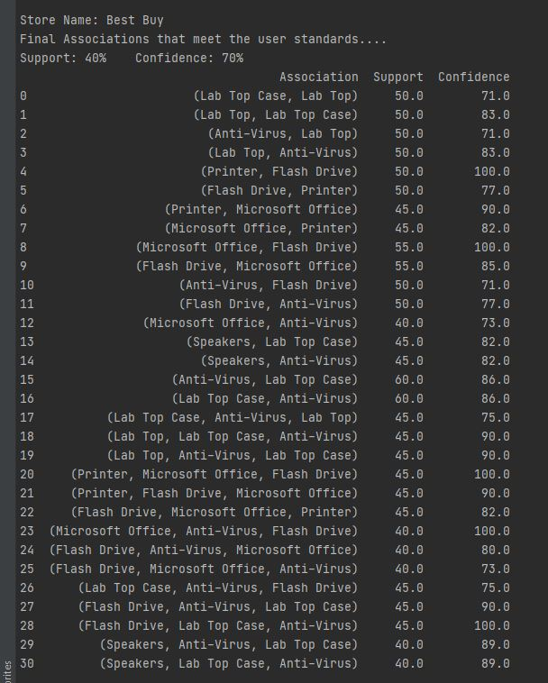

## Running Aprior_Algo.ipynb (Jupyter Notebook)

##### Make sure to run the ENTIRE workbook

##### Answer the following prompts

##### Scroll to the end of the notebook and Viola!! You have your associations!!

## Example (Jupyter Notebook)

##### This will be with a different store with Best Buy, Support = 40% and Confidence = 70%

### Screenshot 1

### Screenshot 2

### Running Aprior_Algo.py (Python File)

##### run the following command in the project directory
##### python Aprior_Algo.py
##### Follow and answer the following prompts

##### Then at the end of the terminal you will get your final associations

## EXAMPLE

##### This will be with a different store with Best Buy, Support = 40% and Confidence = 70%

##### Screenshot 3

##### Screenshot 4

# Enjoy the Aprior Algorithm 2.0
