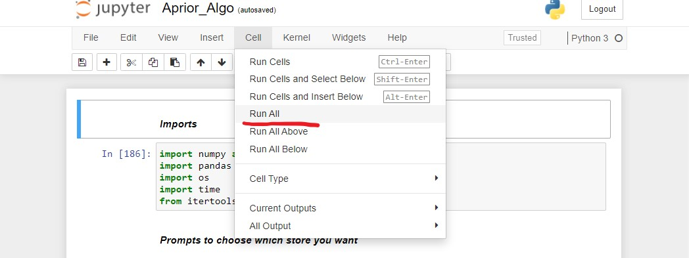
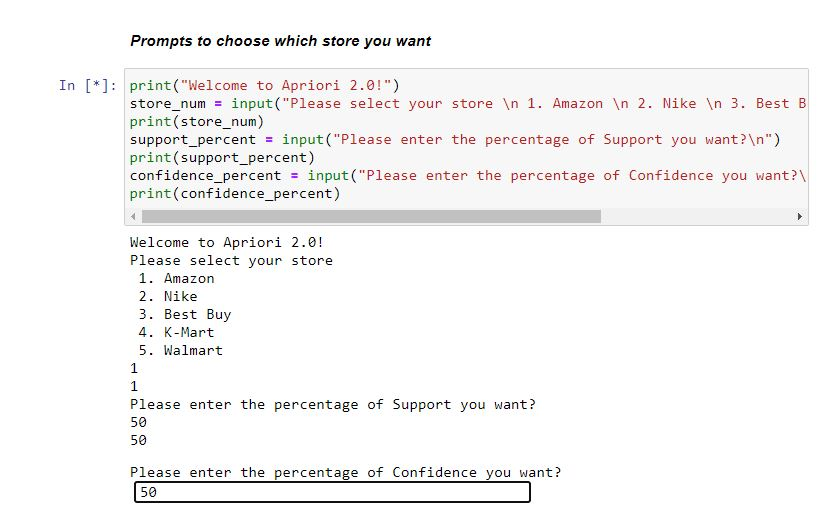
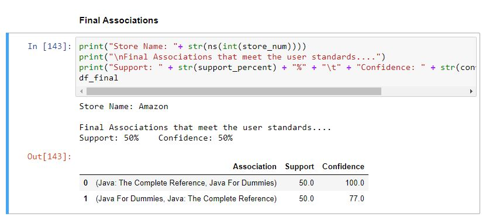
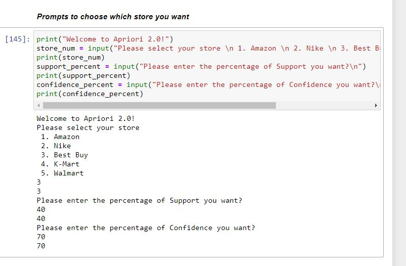
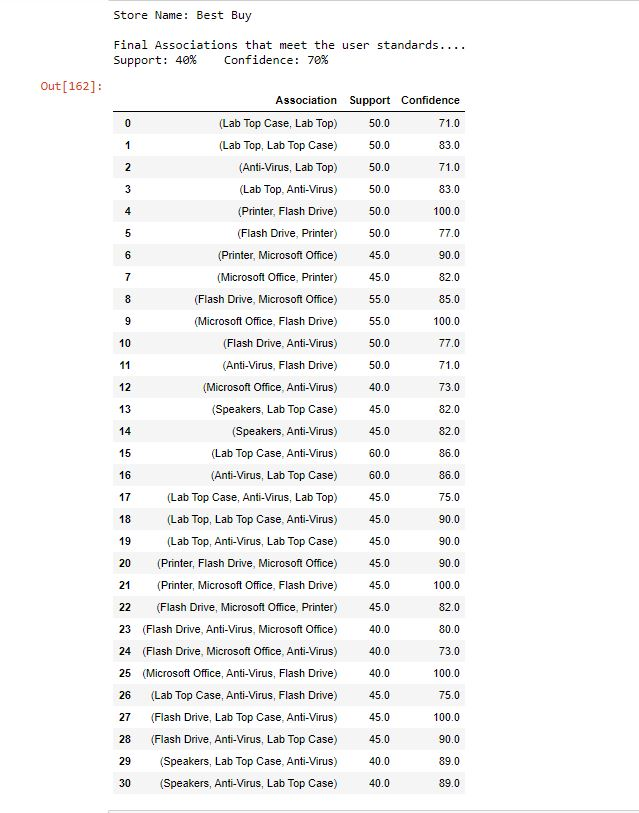
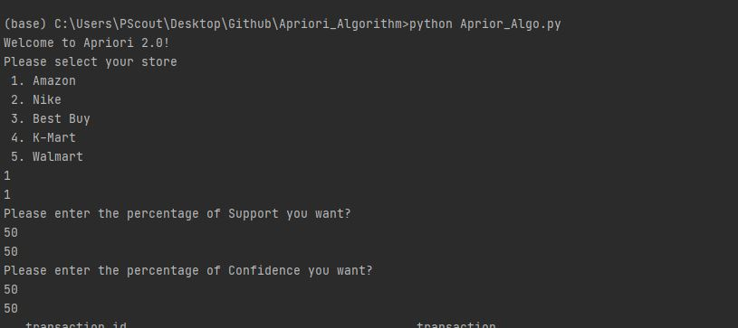
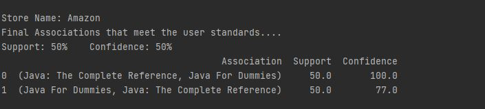
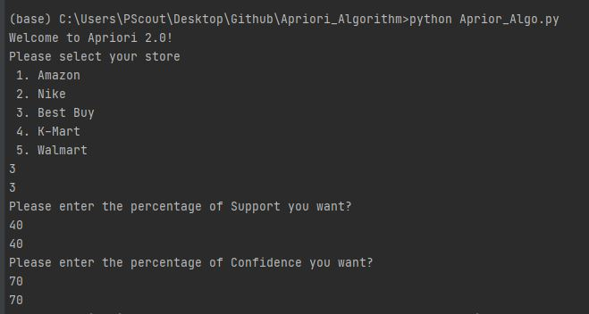
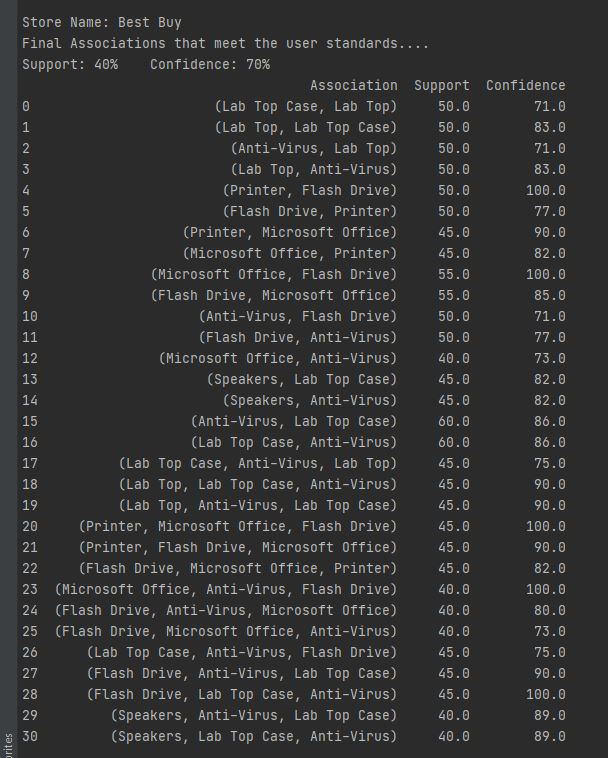

# Apriori_Algorithm

## Tree Directory
##### data : Has all the csv files for the stores
##### Milestones: Has a pdf of the previous milestone documentation
##### Screenshots: Contains screenshots/images of outputs from running the py and ipynb file and is used in the README.md file
##### src: A source folder of a python script to generate a csv file of random transactions given store and items
##### Aprior_Algo.ipynb: The Jupyter Notebook
##### Documentation.ipynb: Jupyter Notebook of the creation of the README.md file
##### Aprior_Algo.py : py script version of the algorithm
##### LICENSE: MIT LICENSE
##### Implementation
* After learning the subject of the Aprior Algorithm in Data Mining, it was in my best interest to use the concept of sets, counters, dataframes, and lambdas, loops, and well defined functions to carry out specific tasks to acheive the Aprior Algorithm. 
## Running Aprior_Algo.ipynb (Jupyter Notebook)

##### Make sure to run the ENTIRE workbook

##### Answer the following prompts

##### Scroll to the end of the notebook and Viola!! You have your associations!!

## Example (Jupyter Notebook)

##### This will be with a different store with Best Buy, Support = 40% and Confidence = 70%

### Screenshot 1

### Screenshot 2

### Running Aprior_Algo.py (Python File)

##### run the following command in the project directory
##### python Aprior_Algo.py
##### Follow and answer the following prompts

##### Then at the end of the terminal you will get your final associations

## EXAMPLE

##### This will be with a different store with Best Buy, Support = 40% and Confidence = 70%

##### Screenshot 3

##### Screenshot 4

# Enjoy the Aprior Algorithm 2.0
